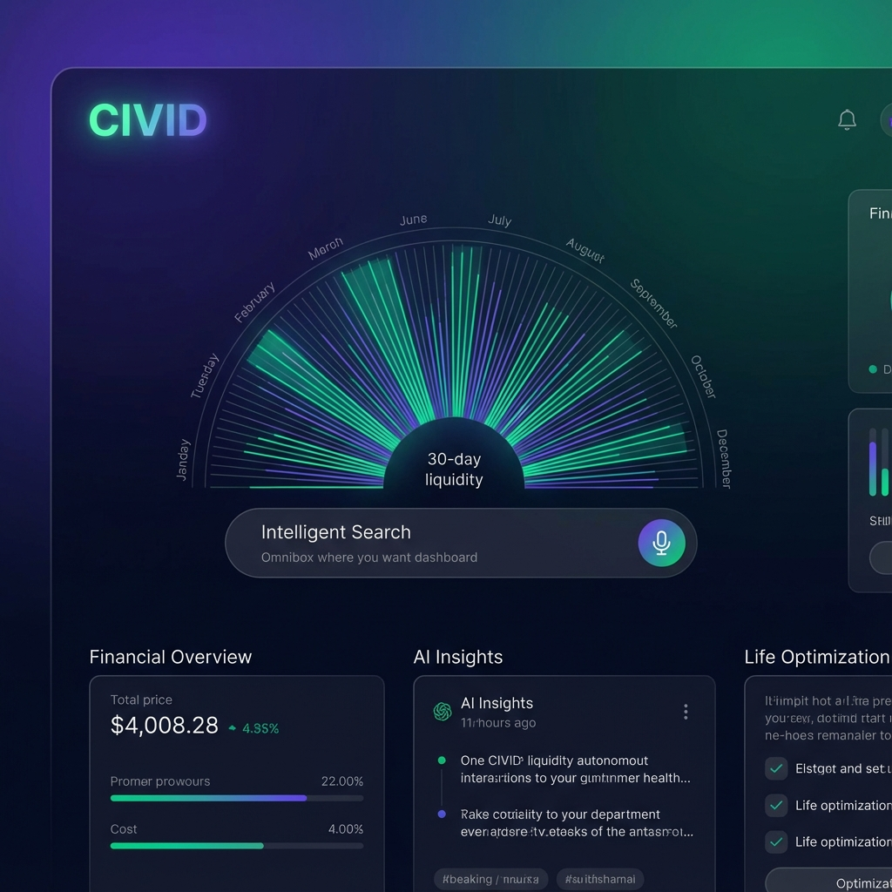

# CIVID - Personal ERP & Autonomous Life Assistant

<p align="center">
  
</p>

**CIVID** is a next-generation Personal ERP designed to automate life management. Built with Laravel 12, React, and Gemini 3, it transforms natural language into structured life events, assets, and financial insights.

---

## 🚀 Key Features

- **Autonomous Ingestion (Gemini 3):** Just type "I paid $20 for gas" or upload a receipt. The AI understands the context, entity, amount, and date, creating a draft for your confirmation.
- **Liquidity Radar:** A dynamic 30-day forecast that tells you exactly how much money you need to stay solvent for the next month.
- **Graph-Based Asset Management:** Connect your vehicle to its insurance, your house to its mortgage, and visualize your entire life ecosystem.
- **Premium Interface:** A glassmorphism-inspired dashboard designed for high-impact visual clarity.

---

## 🛠 Tech Stack

- **Backend:** Laravel 12 (PHP 8.4)
- **Frontend:** React + Inertia.js + Tailwind CSS
- **AI Engine:** Google Gemini 3 (Flash Preview)
- **Database:** PostgreSQL (with potential for pgvector integration)

---

## 📦 Installation

1. **Clone the repo:**
   ```bash
   git clone git@github.com:rafael1599/civid.git
   cd civid/civid
   ```

2. **Setup environment:**
   ```bash
   cp .env.example .env
   # Add your GEMINI_API_KEY to .env
   ```

3. **Install & Run:**
   ```bash
   composer run setup
   composer run dev
   ```

---

## 🧠 Mission

CIVID's mission is to eliminate the friction of personal administration. By applying **First Principles**, we remove redundant forms and manual data entry, allowing the AI to act as your autonomous life agent.

---

## 📄 License

CIVID is open-sourced software licensed under the [MIT license](https://opensource.org/licenses/MIT).
